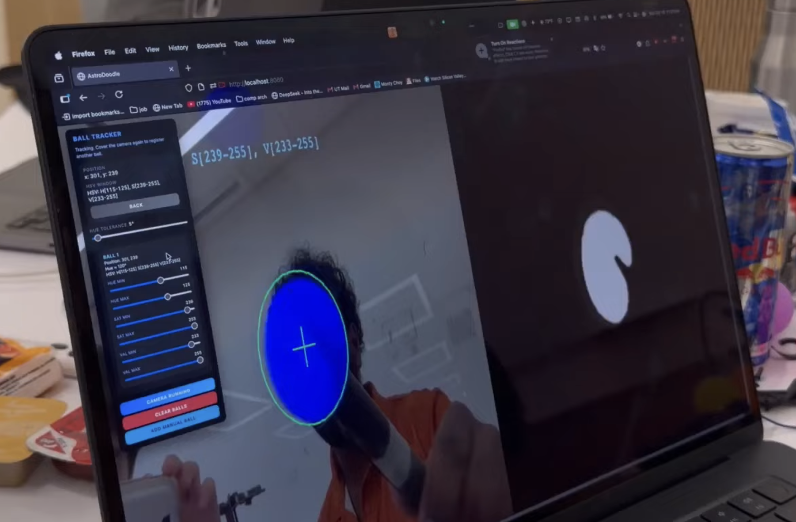
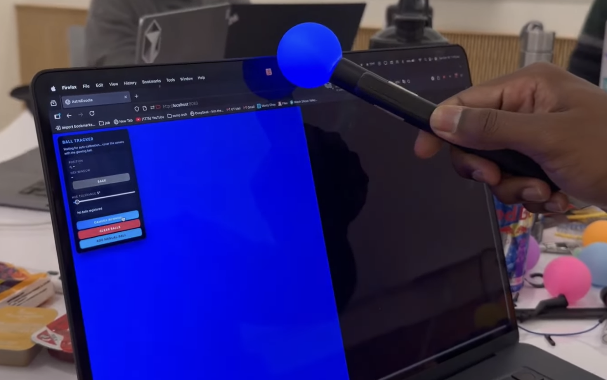

## Summary

AstroDoodle.party reimagines arcade doodle games with physical LED wands that translate real-world gestures into on-screen action through a custom vision pipeline.

## Highlights

- Designed custom 3D-printed wands with onboard LEDs, batteries, and triggers so players can cast spells in the air while the webcam tracks their motion.
- Built an OpenCV pipeline with tap-to-calibrate color sampling, adaptive exposure handling, and dual-mask tracking to stream point-cloud gestures into gameplay.
- Integrated the $Q Super-Quick Recognizer with a Phaser 3 TypeScript engine to translate gestures into spell combos with low-latency feedback.

## Outcome

The project won 1st Place Overall and Best Design at HackTX 2025 (out of 225+ submissions) after a 24-hour build, highlighting the team’s end-to-end rapid prototyping skills.

## What I'm proud of:
One of the biggest challenges with OpenCV color mask applications is proper calibration. The obvious answer is manually tuning your HSV values but that is not very scalable.

### Dynamic tuning
How would a dynamic tuning algorithm work? Within a given frame, the ball has a distinct HSV region.

*Early camera calibration pass showing the regional color mask.*

In the above example, the ball is isolated through masking out all HSV values not in a given range. To dynamically adjust this range, we can look at the size of the ball relative to the screen, which is proportional to its area (closer the ball, the more area it takes up).

Using that, and the assumption that the players will be within a certain distance of the camera, we can adjust the boundaries of the HSV reigon to maintain good visibility of the ball. Since this uses data from previous frames, gradual changes in lighting and exposure won't affect target locking as much as manual adjustment.

### More fun stuff
What if we make a calibration routine that only activates when the entire frame is covered by a ball? 

Since the wand has its own light source, it is relatively easy to isolate within a frame. If we hold the ball up against the camera, the result is a full frame of almost uniform color. 

*Uniform frame while screen is fully covered*

Since the color we want to track is the only thing on the frame, we can start with a very wide HSV reigon and narrow it down as the wand is pulled away to account for environmental lighting differences and changes. This gives us a very robust calibration sequence:

  - The user taps and holds the wand against the camera to seed the initial color sample.
  - The algorithm takes multiple averaged samples and builds a loose HSV region.
  - As the user pulls the wand away, the algorithm starts with a wide tolerance window and gradually narrows it down to a tight tolerance.
  - During gameplay, the thresholds are continuously adjusted to maintain a stable lock on the wand. 
  - This created an adaptive calibration system that maintains a stable lock on the wand despite lighting/exposure changes.

The demo below showcases this feature @ ***[0:28](https://youtu.be/S-x356YyLQ0?t=27)***

## Demo

	<iframe
		src="https://www.youtube.com/embed/S-x356YyLQ0?si=Ktc-Ifh-_ylxXdYD"
		title="AstroDoodle.party demo"
		frameborder="0"
		allow="accelerometer; autoplay; clipboard-write; encrypted-media; gyroscope; picture-in-picture; web-share"
		allowfullscreen
	></iframe>

