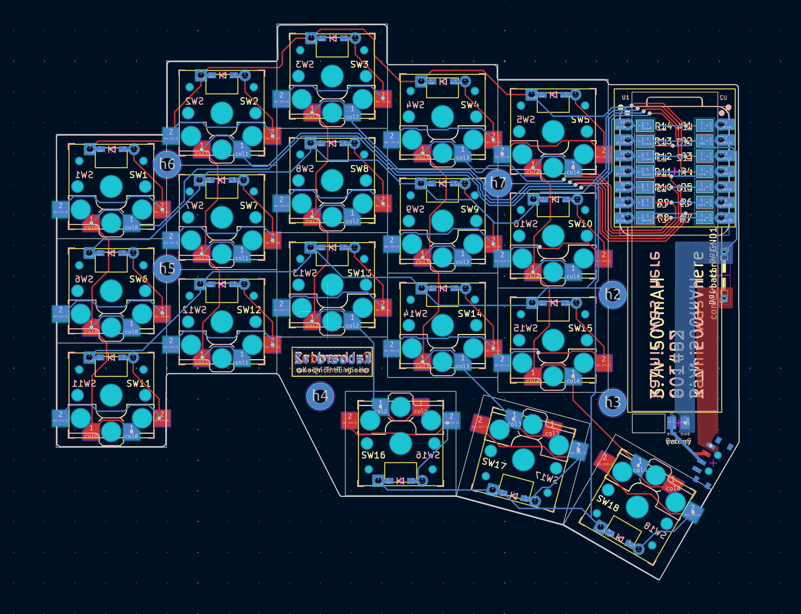
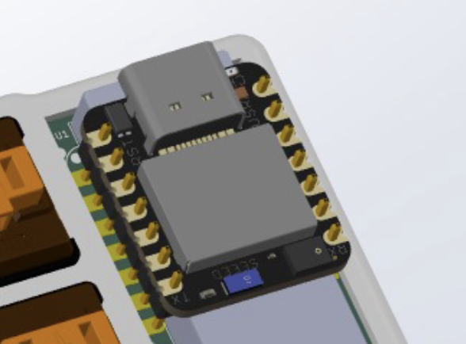
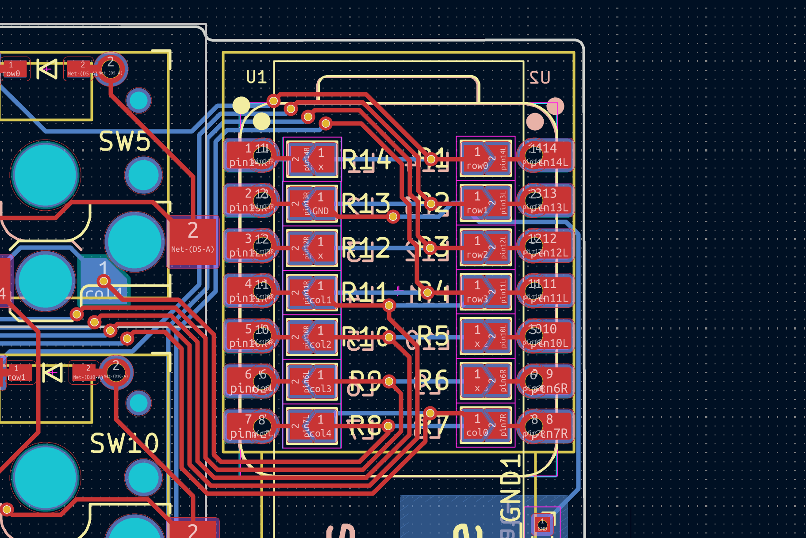
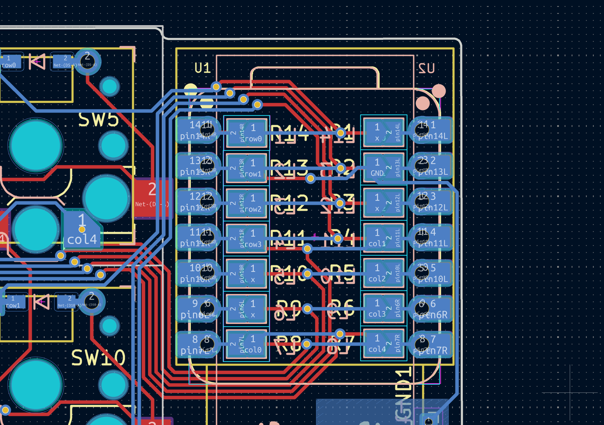
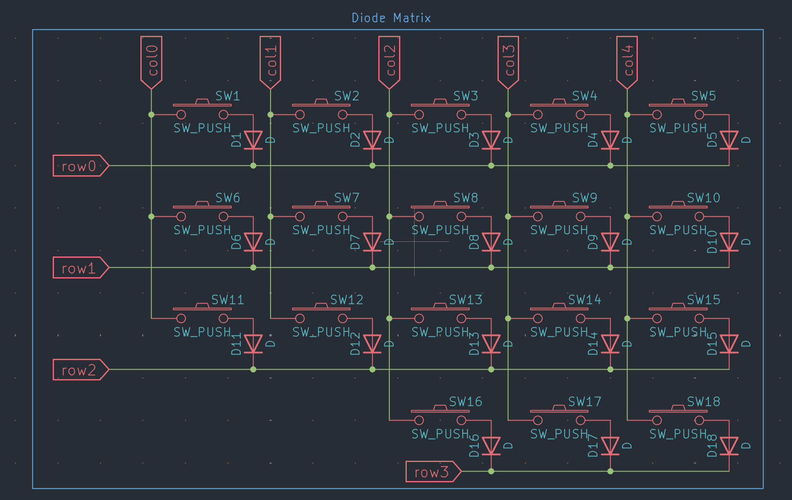

## Summary

I engineered a from-scratch ergonomic split keyboard, from PCB layout through firmware, optimized for ultra-low-power wireless use, everyday reliability, and a truly portable form factor.

## The whiteboard phase
After my last keyboard, I fell in love with split layouts. I wanted a wireless, sleek version I could carry everywhere and not worry about forgetting my aux cable at home. I really liked the <u>[chocofi](https://github.com/pashutk/chocofi)</u>, and my design borrows its spirit while reworking the key spacing, thumb cluster, and (most importantly) the entire MCU interface for Seeed Studio’s Xiao series.

## KiCAD layout
  
*Layout of Kaboard V2's PCB*

#### Unified PCB issues
I wanted a unified PCB where the left and right halves are just front-side/back-side mirrors. Clean idea… but a nightmare for the MCU. Pinouts stop lining up the moment you flip anything, so a straight mirror creates mismatched microcontroller pins between halves.

A lot of keyboards “solve” this by literally flipping the MCU on one side. It works, but it looks messy and kills that perfect mirrored aesthetic I wanted.

  
*MCU interface idea. Flipping the MCU works, but feels wrong.*

#### The solution – Solder bridges!!
I routed every diode-matrix line to both the “left” and “right” pads of the MCU footprint. Tiny solder bridges let the builder pick which side the board should become.  

  
  
*Solder bridges to configure the MCU depending on the half.*

#### What did I get out of this?
A clean mirror-image split board, *plus* I saved around a trillion dollars by not needing two separate PCB designs (tariffs suck man). One design, two roles.

## Schematic
THe keyboard itself is very simple, following a traditional diode matrix. MCU cycles through columns, reading the row state to identify which button was pushed.
It may not be the most performance oriented apprach (edge triggered interrupt based Kaboard V3 will come soon) but it works well enough. 

## Firmware
This is all based on zephyr

## Highlights
- Designed custom PCBs around the nRF52840 to enable sub-16 mm stack height while maintaining full mechanical key travel.
- Built Zephyr/ZMK-based firmware supporting multi-layer layouts, macros, mouse keys, and aggressive low-power behavior.
- Designed a custom enclosure and plate stack-up tuned for ergonomics, balance, and component protection.

## Outcome
The keyboard is now my daily driver. It proved out the whole embedded stack and showed that tailored ergonomics plus custom firmware beats off-the-shelf boards by a mile.