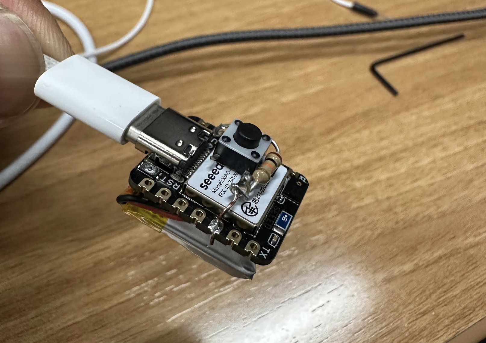
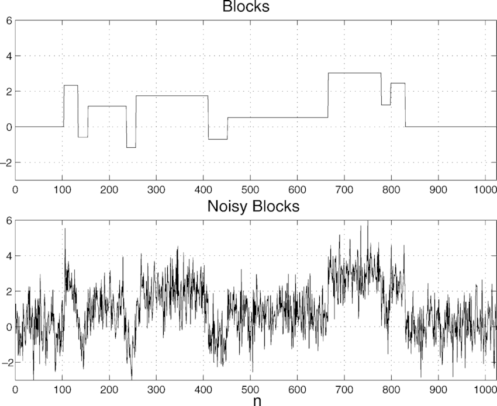
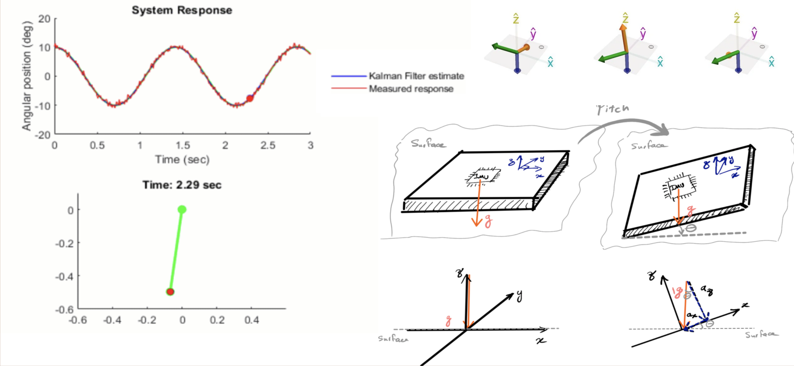

## Summary

**StudyStraight** is a low-cost wearable that monitors posture with onboard processing, alerting students when it detects slouching during study sessions.

## Highlights

- Designed an embedded system with an onboard **LSM6DS3 6-axis IMU** to measure upper-body inclination in real time.  
- Implemented a **2D Kalman filter** in C to fuse accelerometer and gyroscope data, providing smooth and stable orientation estimates despite sensor noise.  
- Added a **hardware calibration button** that instantly re-zeros the posture angle based on the current orientation.  
- Integrated **Bluetooth Low Energy (BLE)** to broadcast a simple posture state (1 = slouching, 0 = upright) for real-time monitoring.  
- Built using the **Seeed Studio nRF52840 Sense**, optimized for low power and ultra-compact design.  

## How it works

I developed the firmware for the wearable portion of the StudyStraight system. The device continuously reads accelerometer and gyroscope data, computes the user’s torso angle, detects slouching, and broadcasts the result via Bluetooth. The companion ESP32 hub receives these values and triggers notifications or timers depending on study posture.

  
*Yes, that’s a USB-C port on there. Yes, it’s that small :)*

### Data Capture and Angle Computation

The onboard **LSM6DS3 IMU** outputs 3-axis acceleration and 3-axis angular velocity data. Using basic trigonometric relationships, the wearable calculates the tilt angle relative to gravity:

```cpp
angleY = atan2(-accX, sqrt(accY * accY + accZ * accZ)) * (180.0 / M_PI);
```
This yields a real-time estimate of the device’s orientation along the Y-axis. However, IMUs are inherently noisy — even tiny hand tremors or vibrations cause the calculated angle to fluctuate drastically, making raw data unusable for posture analysis.



*Example illustration of noise*

Filtering with a Kalman Filter

To address noise, I implemented a Kalman filter that fuses accelerometer and gyroscope readings. The filter predicts the next angle using the gyroscope (which drifts slowly but responds fast) and then corrects it using the accelerometer (which is stable but noisy). This creates a smoothed, accurate orientation estimate without significant lag.

*Illustration to show how slouch angle is calculated*

## Real-Time Calibration

Because everyone wears the device slightly differently, a **calibration button** is connected to GPIO pin 4. When pressed, the firmware adjusts its internal offset so that the *current* orientation becomes the new upright position (i.e., the serial plotter snaps to ~0°). This lets the wearable adapt instantly to the user without restarts or long calibration routines.
Posture Detection and Bluetooth Transmission

## Posture Detection and Bluetooth Transmission
After filtering, the angle is compared to a reference baseline. If the angle deviates by more than ~10° for over ~3 seconds, the firmware flags the posture as “slouching.” This boolean state is written to a BLE characteristic for a connected phone or hub to read:
``` cpp
// 1 = slouching, 0 = upright
slouchCharacteristic.writeValue(slouching ? 1 : 0);
```
The wearable updates at ~20 Hz for a good balance of responsiveness and battery efficiency.

## Firmware Architecture

1. **Read Sensors:** Capture accelerometer and gyroscope values from the IMU.  
2. **Estimate Orientation:** Compute tilt angle and apply Kalman filtering.  
3. **Classify Posture:** Compare the filtered angle against a baseline and detect slouching (threshold + dwell time).  
4. **Transmit State:** Write the boolean slouching state to a BLE characteristic.  
5. **Handle Input:** If the calibration button (GPIO 4) is pressed, re-zero the offset so the current angle becomes 0°.

## Design Goals

StudyStraight was built to be simple, affordable, and effective for students. The Seeed Studio nRF52840 Sense offered everything needed on one tiny board: BLE, an onboard IMU, USB-C, and a Cortex-M4F for real-time filtering. The firmware is fully self-contained in C/C++, optimized for low latency and low power.

## Outcome

The project earned 3rd place at the IEEE Techathon, validating the blend of embedded sensing and applied machine learning in a student-facing tool.
